# Datamodel
This wiki page describes the datamodel, as well as how the database is created, updated and maintained. 

# Table of contents
- [Diagram](#diagram)
- [Generated columns](#generated-columns)
- [Data columns](#data-columns)
- [Alembic](#alembic)
- [Views](#views)
- [SCD1 and SCD2](#scd1-and-scd2)

# Diagram
Below is a generated mermaid diagram of all tables in the database. The technical keys are always based on the generated IDs. For each table, the `key_hash` uniquely identifies an Entity. `key_hashes` are _not_ unique, because of the SCD2 history (`id` is always unique). The `key_hash` is a generated hash of the business keys of the table. The business keys define how an entity is identified, they are listed below.

| Tabel             | Business keys   | Beschrijving                                                                   |
| ----------------- | --------------- | ------------------------------------------------------------------------------ |
| `vehicle_cluster` | `make`, `model` | A cluster is identified by make and model. Many vehicles exist for each model. |
| `vehicle` | `athlon_id` | A vehicle is identified by a unique identifier, provided by Athlon. `athlon_id` has the value of the `id` as returned by athlon. See [vehicle.json](/docs/datamodel/examples/vehicle.json). |
| `option` | `athlon_id`, `vehicle_id` | `athlon_id` has the value of the `id` as returned by athlon. See `options` in [vehicle.json](/docs/datamodel/examples/vehicle.json). In Athlon, each Option is unique by its ID, and shared by vehicles. On our side, we generated a unique ID for each option, by combining it with the `vehicle_id`. This results in one record for each option of each SCD2 version of each vehicle. |
| `vw_vehicle_availability` | `vehicle_key_hash`, `available_since` | The view obviously has no technical keys. However, there should be one row for each availability of each vehicle. |
| `notification` | `vehicle_key_hash`, `available_since` | There is one notification for each availability of each vehicle. We use the composed key of the view. This provides a one-to-one relationship between the notification and the availability: there is at most one notification for each vehicle availability. |

---

```mermaid
erDiagram

    alembic_version {
        version_num character_varying PK "not null"
    }

    notification {
        id uuid PK "not null"
        vehicle_key_hash character_varying "not null"
        available_since timestamp_with_time_zone "not null"
        notified_at timestamp_with_time_zone "null"
        active_from timestamp_with_time_zone "not null"
        active_to timestamp_with_time_zone "null"
        is_current boolean "not null"
        attribute_hash_scd1 character_varying "null"
        attribute_hash_scd2 character_varying "null"
        key_hash character_varying "null"
        created_at timestamp_with_time_zone "null"
        updated_at timestamp_with_time_zone "null"
    }

    option {
        id uuid PK "not null"
        athlon_id character_varying "not null"
        externalId character_varying "not null"
        optionName character_varying "not null"
        included boolean "not null"
        vehicle_id uuid FK "not null"

        active_from timestamp_with_time_zone "not null"
        active_to timestamp_with_time_zone "null"
        is_current boolean "not null"
        attribute_hash_scd1 character_varying "null"
        attribute_hash_scd2 character_varying "null"
        key_hash character_varying "null"
        created_at timestamp_with_time_zone "null"
        updated_at timestamp_with_time_zone "null"
    }

    vehicle {
        id uuid PK "not null"
        vehicle_cluster_id uuid FK "not null"
        athlon_id character_varying "not null"
        external_type_id character_varying "not null"
        make character_varying "not null"
        model character_varying "not null"
        type character_varying "not null"
        uri character_varying "not null"
        external_fuel_type_id integer "not null"
        model_year integer "not null"
        range_in_km integer "not null"
        is_electric boolean "null"
        body_type character_varying "null"
        color character_varying "null"
        external_paint_id character_varying "null"
        image_uri character_varying "null"
        license_plate character_varying "null"
        official_color character_varying "null"
        paint_id character_varying "null"
        registration_date character_varying "null"
        transmission_type character_varying "null"
        type_spare_wheel character_varying "null"
        addition_percentage double_precision "null"
        avg_fuel_consumption double_precision "null"
        base_price_in_euro_per_month double_precision "null"
        calculated_price_in_euro_per_month double_precision "null"
        contribution_in_euro double_precision "null"
        emission double_precision "null"
        expected_fuel_cost_in_euro_per_month double_precision "null"
        fiscal_value_in_euro double_precision "null"
        fuel_price_per_km double_precision "null"
        net_cost_in_euro_per_month double_precision "null"
        price_per_km double_precision "null"
        registered_mileage double_precision "null"

        active_from timestamp_with_time_zone "not null"
        active_to timestamp_with_time_zone "null"
        is_current boolean "not null"
        attribute_hash_scd1 character_varying "null"
        attribute_hash_scd2 character_varying "null"
        key_hash character_varying "null"
        created_at timestamp_with_time_zone "null"
        updated_at timestamp_with_time_zone "null"
    }

    vehicle_cluster {
        id uuid PK "not null"
        external_type_id character_varying "not null"
        first_vehicle_id character_varying "not null"
        image_uri character_varying "not null"
        make character_varying "not null"
        model character_varying "not null"
        addition_percentage double_precision "not null"
        fiscal_value_in_euro double_precision "not null"
        min_price_in_euro_per_month double_precision "not null"
        external_fuel_type_id integer "not null"
        latest_model_year integer "not null"
        max_co2_emission integer "not null"
        vehicle_count integer "not null"

        active_from timestamp_with_time_zone "not null"
        active_to timestamp_with_time_zone "null"
        is_current boolean "not null"
        attribute_hash_scd1 character_varying "null"
        attribute_hash_scd2 character_varying "null"
        key_hash character_varying "null"
        created_at timestamp_with_time_zone "null"
        updated_at timestamp_with_time_zone "null"
    }

    vw_vehicle_availability {
        vehicle_key_hash character_varying "null"
        make text "null"
        model text "null"
        available_since timestamp_with_time_zone "null"
        available_until timestamp_with_time_zone "null"
    }
    vehicle ||--o{ option : "option(vehicle_id) -> vehicle(id)"
    vehicle_cluster ||--o{ vehicle : "vehicle(vehicle_cluster_id) -> vehicle_cluster(id)"
    vw_vehicle_availability ||--o{ vehicle : "vw_vehicle_availability(vehicle_key_hash) -> vehicle(key_hash)"
    notification ||--|| vw_vehicle_availability : "notification(vehicle_key_hash, available_since) -> vw_vehicle_availability(vehicle_key_hash , available_since)"
```

# Generated columns
The following columns are present in all tables. Because of a [known issue](https://stackoverflow.com/questions/77819208/how-can-i-use-alias-in-sqlmodel-library), these generated columns are not prefixed with `_`. Because Postgres does not allow reordering columns, these columns are not the last columns of the tables, but the first. 

_An entity is an entity in the source system, for example a Vehicle. A record is a row for an entity. There will be multiple records for each entity, because SCD2 history is recorded._

- `id` is the unique identifier of the row.
- `key_hash` is the identifier of the entity. A key_hash is _not_ unique, because SCD2 history is recorded for each entity. Therefor, if an SCD2 attribute of an entity changes, a new record is added with the same key_hash. 
- `active_from` is related to SCD2. It indicates the start of the window this record is active.
- `active_to` is related to SCD2. It indicates the end of the window this record is active.
- `is_current` is related to SCD2. It indicates whether this record is the current version of the entity. Each `key_hash` has one record with `is_current=True` at all times. Therefor, filtering on `is_current = TRUE` will provide all active records. Note that this will include deleted entities. An entity is deleted if `active_to IS NOT NULL AND is_current = TRUE`. 
- `attribute_hash_scd1` is related to SCD2. It is the hash of all SCD1 attributes. If an SCD1 attribute value changes, so does the hash. In this case, the record will be updated in-place with the new values and the new scd1 hash.
- `attribute_hash_scd2` is related to SCD2. It is the hash of all SCD2 attributes. If an SCD2 attribute value changes, so does the hash. In this case, the record for this `key_hash` with `is_current=TRUE` is closed. A new row is added, with `is_current=TRUE` and `active_from=now()`, with the current values and scd2 hash.
- `created_at` is the timestamp the record was created
- `updated_at` is the timestamp the record was last updated. 

# Data columns
All non-generated columns are directly provided by the source. It's possible some flattening is performed, because the source sometimes provides nested json. Example values are provided in [examples](/docs/datamodel/examples/).

# Alembic
`alembic_versions` is automatically generated and maintained by [Alembic](https://alembic.sqlalchemy.org/en/latest/index.html), the database migration tool.

# Views
The following views are present in the database. They are created by manually running the definitions in [sql_scripts](/sql_scripts/).

## `vw_vehicle_availability`
This view indicates availabilities of vehicles. It is based on the SCD2 history of `vehicle`. The idea is to create a record for each time window a vehicle is available. When a vehicle is not available anymore, it is leased by someone. The row in `vw_vehicle_availability` will then have `available_untill IS NOT NULL`. When `available_untill IS NULL`, the vehicle is currently available. When a vehicle comes back online after some days, the vehicle is available again, after being unavailable for some timewindow > 0. In this case, a new record for the `vehicle_key_hash` is created, with `active_to IS NULL` untill the vehicle 'disapears' again. 

The definition basically groups SCD2 records for each entity, as long as they are directly adjacent. Direct adjacentness means that some SCD2-attribute-changes triggered the creation of a new record. For this view, we are only interested in changes that indicate a DELETE of the vehicle, and not an UPDATE. A DELETE is indicated by the `active_to` of one record being not equal to the `active_from` of the next, meaning the vehicle was _unavailable_ for the time gap in between those records. When records are grouped (because they are directly adjacent), the `available_from` is set to the first `active_from`, and the `available_until` is set to the last `active_to` of the group. 

# SCD1 and SCD2
SCD1 and SCD2 logic is applied in the [Upserter](/src/athlon_flex_notifier/upserter.py). By default, all non-key attributes of each table are stored with SCD2 history enabled. Some columns change often, for example the `latest_model_year` of a VehicleCluster. To prevent many SCD2 records, one can define SCD1 attributes for each table. Whenever such a value is changed, the currently `is_current=TRUE` record of the entity is updated in-place with the new attributes, and `attribute_hash_scd1` is updated accordingly. A table can defines this list through property `scd1_attribute_keys`. 

Any updates are always only applied to records with `is_current=TRUE`. Whenever `is_current=FALSE`, a newer version for the entity exists, and we should never update older records. Entities are identified by their `key_hash`. This `key_hash` is generated based on the `business_keys` that each table MUST define. The following logic is now applied in the upserter:

## SCD1
We are processing a new batch of entities. target=Database, source=New batch. For each record in target for which the key hash exists in source, but the `attribute_hash_scd1` is unequal, we update the SCD1 attributes and the `attribute_hash_scd1`. Note that the `key_hash` always identifies an entity. 

## SCD2
We are processing a new batch of entities. target=Database, source=New batch. 
### Closing existing records of updated entities.
For each record in target for which the key hash exists in source, but the `attribute_hash_scd2` is unequal, we close the existing record. Closing means setting `active_to=now()`, and `is_current=FALSE`. We will create a new record for this entity later on.

### Close active records of deleted entities
_This step is only performed if the `LOAD_TYPE` of the entity = `FULL_LOAD`. DELTA loads will only upsert, not delete from target. All entities of the Athlon API are loaded with `LOAD_TYPE=FULL_LOAD`._

For full load entities, we know that any records in target that are not in source, are deleted. We close those records. In this case, closing means setting `active_to=now()`. We leave `is_current=TRUE`. This tells us: this records is the current row of the entity, but the entity is deleted (since `active_to IS NOT NULL`). 

### Create new rows for updated and new entities
We now insert new rows for our entities that are either SCD2 updated, or completely new. These new records have `active_from=now()`, and `is_current=TRUE`. We check whether the `key_hash` of source is not present in target, where target is filtered on `is_active=NONE`. Any `key_hash` that is in source but not on the filtered target is new (the `key_hash` is not in target at all), or updated (the `key_hash` is in target, but filtered out because `is_active` was set in [This step](#closing-existing-records-of-updated-entities)). We simply insert all records with key_hashes that remain. 